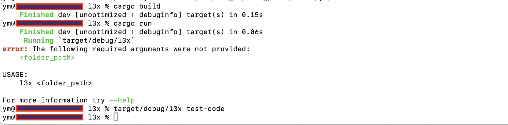

# L3X - AI-driven Static Analyzer

L3X detects vulnerabilities in Rust and Solidity code based on patterns and AI code analysis. Various LLMs act as validators for vulnerabilities detected by patterns and validate each other's results in AI code analysis. Vulnerabilities are confirmed when they receive confirmation from a majority of validators. As a result, a report with validated vulnerabilities and detected safe patterns is generated.

## Supported Languages and Smart Contracts:

- General Rust code
- Rust-based Solana smart contracts
- Solidity-based Ethereum smart contracts

## Design


## How It Works

- **Vulnerability Patterns Analysis:** Analysis of code for
    - [Rust-General](etc/patterns-rust.md)
    - [Rust-Solana](etc/patterns-sol.md)
    - [Solidity-Ethereum](etc/patterns-eth-solidity.md)
- **AI Code Analysis:** Analysis of smart contract code for vulnerabilities using Language Model validators (LLMs).
- **LLM Validators:** Potential vulnerabilities detected are passed on to multiple LLM validators for confirmation. Three different models are utilized: GPT-4, Gemini, and Claude 2.
- **Validation Process:** Each validator independently assesses potential vulnerabilities. Detected vulnerabilities undergo a validation check.
- **Decision Making:**
  - **Valid:** A vulnerability is confirmed as valid when at least two LLM validators agree.
  - **False Positive:** A finding is marked as a false positive when identified as such by at least two validators.
- **Cross-Validation:** Each LLM performs a cross-validation check during the AI Code Analysis phase.
- **Report Generation:** A report is generated that compiles all confirmed vulnerabilities, with duplicates removed.

## Current limitations

> Currently it's MVP 

1. Vulnerabilities detects only based on vuln patterns
2. GPT-3.5 act as validators for vulnerabilities detected by patterns

## LLM supported

- GPT-3.5
- GPT-4 (Soon)
- Claude (Planned)
- Gemini (Planned)

## Set API Keys

Set the openai api key as an environment variable OPENAI_KEY in your operating system

Linux/Mac

```bash
export OPENAI_KEY=sk-ApiKeyExample
```

Windows

```bash
set OPENAI_KEY=sk-ApiKeyExample
```

## How to Use ❓

1. Build
```bash
cargo build
```
2. Compile
```bash
cargo run
```
3. Run
```bash
l3x smart-contracts-folder-to-analyse
```

## Usage Example 🏁




[Report example - Rust](https://github.com/VulnPlanet/l3x/blob/main/etc/L3X_SAST_Report_Rust.html)

[Report example - Solana](https://github.com/VulnPlanet/l3x/blob/main/etc/L3X_SAST_Report.html)

[Report example - Ethereum](https://github.com/VulnPlanet/l3x/blob/main/etc/Solidity-Ethereum_L3X_SAST_Report.html)

## Roadmap 🗓️

- ~~Design~~
- ~~MVP concept~~
- ~~Rust support~~
- ~~Solana support~~
- ~~Solidity support~~
- GPT-4 Integration 🔜 
- Claude Integration 
- Gemini Integration 
- AI Code Analysis
- AI Code Analysis - Cross-Validation
- Refactor
- Accuracy Comparison

## Contact 📧

All suggestions write to contact contact@vulnplanet.com
